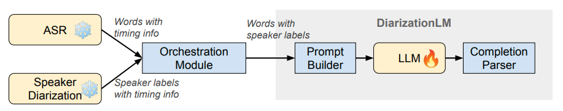
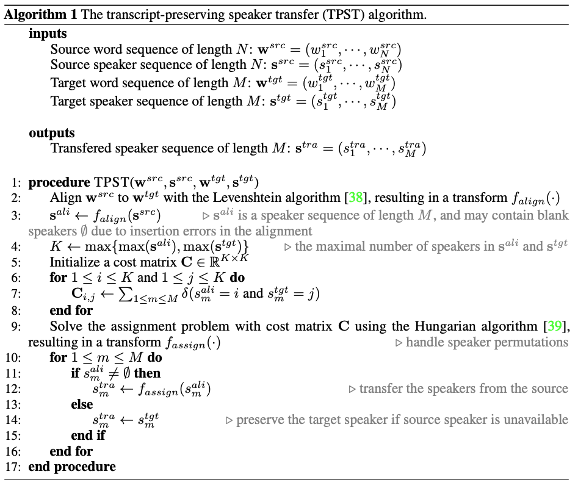

# DiarizationLM

[](https://github.com/google/speaker-id/actions/workflows/python-app-diarizationlm.yml)
[](https://pypi.python.org/pypi/diarizationlm)
[](https://pypi.org/project/diarizationlm)
[](https://www.pepy.tech/projects/diarizationlm)
[](https://codecov.io/gh/google/speaker-id)
[](https://arxiv.org/abs/2401.03506)
[](https://huggingface.co/google/DiarizationLM-13b-Fisher-v1)


## Table of contents

* [Overview](#Overview)
* [Instructions](#Instructions)
  * [Install the package](#Install-the-package)
  * [Data format](#Data-format)
  * [Conversion between representations](#Conversion-between-representations)
  * [Transcript-preserving speaker transfer (TPST)](#Transcript-preserving-speaker-transfer-TPST)
  * [Training data preparation](#Training-data-preparation)
  * [LLM finetuning and inference (OpenAI)](#LLM-finetuning-and-inference-OpenAI)
  * [LLM finetuning and inference (Llama 2)](#LLM-finetuning-and-inference-Llama-2)
  * [Completion parser](#Completion-parser)
  * [Metrics](#Metrics)
* [Citation](#Citation)

## Overview

Here we open source some functions and tools used in the [DiarizationLM paper](https://arxiv.org/abs/2401.03506).

We also have open source models on Hugging Face: https://huggingface.co/google/DiarizationLM-13b-Fisher-v1


## Disclaimer

**This is NOT an official Google product.**

## Instructions



### Install the package

You can install the package with:

```
pip install diarizationlm
```

Once installed, you can directly use many of the existing functions from the package. For example:

```python
import diarizationlm

src_text = "hello good morning hi how are you pretty good"
src_spk = "1 1 1 2 2 2 2 1 1"
tgt_text = "hello morning hi hey are you be good"
tgt_spk = "1 2 2 2 1 1 2 1"
transferred_spk = diarizationlm.transcript_preserving_speaker_transfer(
    src_text, src_spk, tgt_text, tgt_spk)
print(transferred_spk)
```

### Data format

We assume all internal data are stored in JSON files. An example is `testdata/example_data.json`. The field `"utterances"` stores a list of utterances, and in each utterance we have these string fields:

| Field | Description |
| ----- | ----------- |
| `"utterance_id"` | This stores the utterance ID.|
| `"hyp_text"` | This stores the sequence of hypothesis words, but joined by spaces.|
| `"hyp_spk"` | This stores the sequence of hypothesis speakers, but joined by spaces.|
| `"hyp_diarized_text"` | This is the text representation of the hypothesis words and speakers. It can be used for debugging and to build the prompts to LLM.|
| `"ref_*"` | Similar to the `"hyp_*"` fields, but these are ground truth reference, rather than hypothesis.|

### Conversion between representations

In the paper, we mentioned two representations:

1. The word sequence and speaker sequence representation.
2. The pure text representation.

Example:

```
Word sequence:         ["good", "morning", "how", "are", "you"]
Speaker sequence:      [1, 1, 2, 2, 2]
Text representation:   "<spk:1> good morning <spk:2> how are you"
```

We provide the functions in `diarizationlm/utils.py` to convert between these two representations:

* `create_diarized_text()` converts the word and speaker sequences to the pure text representation.
* `extract_text_and_spk()` converts the pure text representation to the word and speaker sequences.

### Transcript-preserving speaker transfer (TPST)

TPST is a critical data processing algorithm used in multiple places in our paper.

A Python implementation is available in `diarizationlm/utils.py`, defined as:

```Python
def transcript_preserving_speaker_transfer(
    src_text: str, src_spk: str, tgt_text: str, tgt_spk: str
) -> str
```



### Training data preparation

We provide a Python script `train_data_prep.py` that can be used for preparing the dataset for finetuning LLMs (i.e. the prompt builder module described in the paper). This tool will do these for you:

1. Segment the prompts and completions based on the input and output length limit.
2. Optionally apply prefix and suffix to prompts and completions.
3. Store prompt-completion pairs in different file formats.

The segmentation length, prefix, and suffix are passed in as flags to `train_data_prep.py`. In Python code, they are configured as `PromptOptions` defined in `utils.py`.

We support 3 different output file formats:

| Format | Description |
| ------ | ----------- |
| `tfrecord` | The [TFRecord format](https://www.tensorflow.org/tutorials/load_data/tfrecord) can be used by various machine learning libraries.|
| `json` | This format is more human readable and can be used for debugging. It's also useful for finetuning PaLM models via the [Google Cloud API](https://cloud.google.com/vertex-ai/docs/generative-ai/models/tune-text-models-supervised#text).|
| `csv` | This format can be used by many existing tools. OpenAI also provides a tool to convert csv files to jsonl files.|
| `jsonl` | This format can be directly used by the [OpenAI API](https://platform.openai.com/docs/api-reference/) for finetuning GPT models.|

Example command:

```bash
python3 train_data_prep.py \
--input="testdata/example_data.json" \
--output="/tmp/example_data.jsonl" \
--output_type=jsonl \
--emit_input_length=1000 \
--emit_target_length=1000 \
--prompt_suffix=" --> " \
--completion_suffix=" [eod]" \
--input_feature_key="prompt" \
--output_feature_key="completion"
```

### LLM finetuning and inference (OpenAI)

> **Warning: This step is very costly! Proceed with caution at your own risk. Also GPT models are very different from PaLM models. Reproducibility is not guaranteed!**

In our paper, we used Google's internal tools to finetune PaLM 2 models and to run the model inference. Google's policy does not allow us to disclose any details about the tools and the PaLM 2 models.

However, if you are interested in reproducing some of our experiments, one option is to use other alternative LLMs, such as OpenAI's GPT models.

Using the `train_data_prep.py` tool mentioned above, you can create `csv` files, and use OpenAI libraries to convert to the jsonl format. Example command:

```
openai tools fine_tunes.prepare_data -f train_data.csv
```

Once you have the training data in jsonl format, you can finetune GPT models with the data, either via the API or using OpenAI's web UI. For example:

```
openai api fine_tunes.create -t "train_data.jsonl"
```

After you have finetuned a model, we provide a Python script `run_finetuned_gpt.py` to run the GPT model inference on testing data. You need to provide your `--api_key` and `--engine` to the script.

### LLM finetuning and inference (Llama 2)

We open sourced Llama 2 based models on Hugging Face: https://huggingface.co/google/DiarizationLM-13b-Fisher-v1

The scripts to finetune this model is available in the `unsloth` folder.

### Completion parser

During inference, the prompts are send to the LLM, and the LLM will generate the completions. We provide a `postprocess_completions.py` script that serves as the completion parser module as described in the paper. It will:

1. Truncate the completion suffix, and any text generated after this suffix.
2. Concatenate the completions of all segments from the same utterance.
3. Transfer the speakers to the original hypothesis ASR transcript.

### Metrics

We report three metrics in our paper:

* [Word Error Rate (WER)](https://en.wikipedia.org/wiki/Word_error_rate)
* [Word Diarization Error Rate (WDER)](https://arxiv.org/pdf/1907.05337)
* [Concatenated minimum-permutation Word Error Rate (cpWER)](https://arxiv.org/pdf/2004.09249)

Also, we would like to highlight that all these three metrics reported in our
papers are **micro** metrics, i.e. both numerators and denominators are
aggregated on the entire dataset.

We provide an implementation of WER, WDER and cpWER in `metrics.py`. If you use
our json-based data format, you can call our script to produce metrics as below:

```
python3 compute_metrics_on_json.py \
--input=testdata/example_data.json \
--output=/tmp/example_metrics.json
```

If you use our `postprocess_completions.py` script to process the LLM results,
you need to specify `--hyp_spk_field="hyp_spk_llm"` when running
`compute_metrics_on_json.py`.

Also please note that this implementation is different from Google's internal implementation that we used in the paper, but is a best-effort attempt to
replicate the results. The biggest differences are from text normalization,
such as de-punctuation.

## Citation

Our paper is cited as:

```
@article{wang2024diarizationlm,
  title={{DiarizationLM: Speaker Diarization Post-Processing with Large Language Models}},
  author={Quan Wang and Yiling Huang and Guanlong Zhao and Evan Clark and Wei Xia and Hank Liao},
  journal={arXiv preprint arXiv:2401.03506},
  year={2024}
}
```
